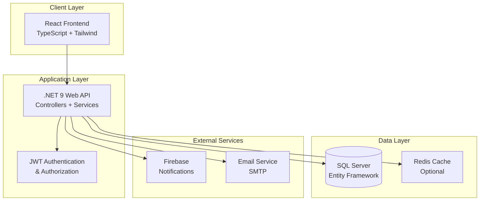

# DMBApp - Enterprise Document Management System

[](https://dotnet.microsoft.com/download/dotnet/9.0)
[](https://reactjs.org/)
[](https://www.typescriptlang.org/)
[](https://www.microsoft.com/en-us/sql-server)
[](https://www.docker.com/)
[](LICENSE)

A **comprehensive full-stack enterprise document management system** with advanced workflow automation, circuit-based approval processes, and multi-user collaboration features. Built with modern technologies and designed for scalability, security, and performance.

## 🌟 Key Highlights

- **🚀 Modern Architecture**: Built with .NET 9 and React 18 for optimal performance
- **🔐 Enterprise Security**: JWT authentication with role-based access control
- **📊 Advanced Analytics**: Real-time dashboards and comprehensive reporting
- **🌐 Cloud Ready**: Docker containerization and scalable deployment
- **📱 Responsive Design**: Beautiful UI that works on all devices
- **⚡ High Performance**: Optimized for handling large document volumes
- **🔄 Real-time Sync**: Live updates and collaborative features
- **🌍 Internationalization**: Multi-language support ready

## 🚀 Project Overview

**DMBApp** is an enterprise-grade document management platform that revolutionizes how organizations handle document workflows, approvals, and collaboration. Designed for scalability and built with cutting-edge technologies, it provides:

### 🎯 Core Capabilities

- **📄 Advanced Document Management**: Complete document lifecycle with versioning, metadata, and search
- **🔄 Intelligent Workflow Engine**: Circuit-based approval systems with parallel and sequential processing
- **👥 Comprehensive User Management**: Role-based access control with organizational hierarchy
- **📋 Dynamic Line Item System**: Flexible document structure with customizable elements
- **📊 Analytics & Reporting**: Real-time dashboards and business intelligence
- **🔗 API-First Design**: RESTful APIs with comprehensive documentation
- **🛡️ Enterprise Security**: Multi-layer security with audit trails
- **📱 Modern UI/UX**: Intuitive interface with dark/light themes

### 🏢 Perfect For

- **Corporate Document Management**
- **Approval Workflow Automation**
- **Compliance and Audit Systems**
- **Contract Management**
- **Invoice Processing**
- **HR Document Systems**
- **Quality Management Systems**

## 📁 System Architecture

### 🏗️ High-Level Architecture



### 📂 Project Structure

```
DMBApp/                              # 🏠 Main application root
├── 📁 DocManagementBackend/         # 🚀 .NET 9 Web API Backend
│   ├── 📁 Controllers/              # 🎯 API endpoint controllers
│   │   ├── AccountController.cs     # User account management
│   │   ├── ActionController.cs      # Workflow actions
│   │   ├── AdminController.cs       # Admin operations
│   │   ├── DocumentController.cs    # Document CRUD operations
│   │   ├── ApprovalController.cs    # Approval workflows
│   │   └── CircuitController.cs     # Circuit management
│   ├── 📁 Models/                   # 📊 Domain entities & DTOs
│   │   ├── Document.cs              # Document entity
│   │   ├── User.cs                  # User entity
│   │   ├── Circuit.cs               # Workflow circuit
│   │   ├── Approval.cs              # Approval entity
│   │   └── DTOs/                    # Data transfer objects
│   ├── 📁 Services/                 # 🔧 Business logic layer
│   │   ├── DocumentService.cs       # Document business logic
│   │   ├── AuthService.cs           # Authentication logic
│   │   ├── WorkflowService.cs       # Workflow processing
│   │   ├── NotificationService.cs   # Notification handling
│   │   └── ApiSyncService.cs        # External API sync
│   ├── 📁 Data/                     # 🗄️ Data access layer
│   │   ├── ApplicationDbContext.cs  # EF Core context
│   │   ├── DataSeeder.cs           # Initial data seeding
│   │   └── Repositories/           # Repository pattern
│   ├── 📁 Migrations/               # 📈 Database migrations
│   ├── 📁 Utils/                    # 🛠️ Utility classes
│   ├── 📁 Middleware/               # ⚙️ Custom middleware
│   ├── 📁 wwwroot/                  # 📁 Static files & uploads
│   └── 📁 docs/                     # 📚 API documentation
├── 📁 DocManagementFrontend/        # 💻 React TypeScript Frontend
│   ├── 📁 src/                      # 📦 Source code
│   │   ├── 📁 components/           # 🧩 React components
│   │   │   ├── 📁 ui/              # Base UI components (shadcn/ui)
│   │   │   ├── 📁 dashboard/       # Dashboard components
│   │   │   ├── 📁 documents/       # Document management UI
│   │   │   ├── 📁 workflows/       # Workflow UI components
│   │   │   ├── 📁 admin/           # Admin interface
│   │   │   └── 📁 shared/          # Shared components
│   │   ├── 📁 pages/               # 📄 Page components (routes)
│   │   ├── 📁 services/            # 🔌 API integration layer
│   │   ├── 📁 hooks/               # 🎣 Custom React hooks
│   │   ├── 📁 context/             # 🌐 React context providers
│   │   ├── 📁 types/               # 📝 TypeScript type definitions
│   │   ├── 📁 utils/               # 🛠️ Utility functions
│   │   └── 📁 styles/              # 🎨 Global styles & themes
│   ├── 📁 public/                  # 🌍 Static assets
│   ├── 📁 docs/                    # 📖 Component documentation
│   └── 📄 dist/                    # 📦 Built application (after build)
├── 📁 Database/                     # 🗄️ Database scripts & backups
│   ├── 📄 schema.sql               # Database schema
│   ├── 📄 seed-data.sql            # Initial data
│   └── 📁 backups/                 # Database backups
├── 📁 Documentation/                # 📚 Project documentation
│   ├── 📄 API.md                   # API documentation
│   ├── 📄 DEPLOYMENT.md            # Deployment guide
│   ├── 📄 ARCHITECTURE.md          # System architecture
│   └── 📄 SECURITY.md              # Security guidelines
├── 📁 Scripts/                      # 🔧 Automation scripts
│   ├── 📄 deploy.sh                # Deployment script
│   ├── 📄 backup.sh                # Backup script
│   └── 📄 setup.sh                 # Environment setup
├── 📄 docker-compose.yml           # 🐳 Docker orchestration
├── 📄 .gitignore                   # 🚫 Git ignore rules
├── 📄 LICENSE                      # ⚖️ MIT License
└── 📄 README.md                    # 📖 This file
```

## 🛠️ Technology Stack

### 🎯 Backend Technology (.NET 9)

#### Core Framework
- **🚀 ASP.NET Core 9.0**: Latest high-performance web framework
- **🗄️ Entity Framework Core**: Code-first ORM with migrations
- **💾 SQL Server**: Enterprise-grade relational database
- **🔐 JWT Authentication**: Stateless token-based security
- **📊 Swagger/OpenAPI**: Interactive API documentation
- **🐳 Docker**: Containerization and deployment

#### Security & Authentication
- **🔒 BCrypt**: Secure password hashing with salt
- **🛡️ CORS**: Cross-origin resource sharing configuration
- **🔑 JWT Bearer Tokens**: Stateless authentication
- **👤 Role-Based Authorization**: Granular permission system
- **🔐 Data Protection**: Encrypted sensitive data storage

#### External Integrations
- **🔥 Firebase Admin SDK**: Push notifications and analytics
- **📧 Email Service**: SMTP integration for notifications
- **📱 SMS Service**: Optional SMS notifications
- **☁️ Cloud Storage**: File upload and management

#### Key Dependencies
```xml
<!-- Core Framework -->
<PackageReference Include="Microsoft.AspNetCore.App" Version="9.0.2" />
<PackageReference Include="Microsoft.EntityFrameworkCore.SqlServer" Version="9.0.2" />
<PackageReference Include="Microsoft.EntityFrameworkCore.Tools" Version="9.0.2" />

<!-- Authentication & Security -->
<PackageReference Include="Microsoft.AspNetCore.Authentication.JwtBearer" Version="9.0.2" />
<PackageReference Include="BCrypt.Net-Next" Version="4.0.3" />
<PackageReference Include="System.IdentityModel.Tokens.Jwt" Version="8.0.2" />

<!-- External Services -->
<PackageReference Include="FirebaseAdmin" Version="3.1.0" />
<PackageReference Include="MailKit" Version="4.7.1" />

<!-- API Documentation -->
<PackageReference Include="Swashbuckle.AspNetCore" Version="7.2.0" />
<PackageReference Include="Microsoft.AspNetCore.OpenApi" Version="9.0.2" />

<!-- Utilities -->
<PackageReference Include="AutoMapper" Version="13.0.1" />
<PackageReference Include="Serilog.AspNetCore" Version="8.0.3" />
```

### 💻 Frontend Technology (React + TypeScript)

#### Core Framework
- **⚛️ React 18.3.1**: Latest React with Concurrent Features
- **📘 TypeScript 5.5.3**: Type-safe JavaScript with strict mode
- **⚡ Vite 6.2.4**: Next-generation build tool for lightning-fast development
- **🧭 React Router v6**: Declarative routing with nested routes
- **🔄 React Query**: Powerful server state management

#### UI & Styling
- **🎨 Tailwind CSS 3.4.11**: Utility-first CSS framework
- **🧩 shadcn/ui**: High-quality accessible components
- **🎭 Radix UI**: Unstyled, accessible UI primitives
- **🎪 Framer Motion**: Production-ready motion library
- **🎯 Lucide React**: Beautiful SVG icon library
- **🌙 Next Themes**: Dark/light mode support

#### State Management & Forms
- **🗂️ TanStack Query**: Server state synchronization
- **🌐 React Context**: Global state management
- **📝 React Hook Form**: Performant forms with minimal re-renders
- **✅ Zod**: TypeScript-first schema validation
- **🎣 Custom Hooks**: Reusable stateful logic

#### Development & Quality
- **🔍 ESLint**: Code quality and consistency
- **💅 Prettier**: Code formatting
- **🧪 Vitest**: Unit testing framework
- **📚 Storybook**: Component documentation
- **🐙 Husky**: Git hooks for quality gates

#### Key Dependencies
```json
{
  // Core React Ecosystem
  "react": "^18.3.1",
  "react-dom": "^18.3.1",
  "typescript": "^5.5.3",
  "vite": "^6.2.4",
  
  // Routing & State Management
  "react-router-dom": "^6.26.2",
  "@tanstack/react-query": "^5.56.2",
  
  // UI Framework & Styling
  "tailwindcss": "^3.4.11",
  "@radix-ui/react-*": "latest",
  "framer-motion": "^12.11.0",
  "lucide-react": "^0.462.0",
  
  // Form Management
  "react-hook-form": "^7.53.0",
  "zod": "^3.23.8",
  "@hookform/resolvers": "^3.9.0",
  
  // Data Visualization
  "recharts": "^2.12.7",
  "react-flow-renderer": "^10.3.17",
  
  // Utilities
  "axios": "^1.8.4",
  "date-fns": "^3.6.0",
  "clsx": "^2.1.1",
  "lodash": "^4.17.21"
}
```

### 🗄️ Database & Infrastructure

#### Database Technology
- **🏢 SQL Server 2019+**: Enterprise-grade RDBMS
- **🔄 Entity Framework Core**: Code-first migrations
- **📊 SQL Server Management Studio**: Database administration
- **🔍 Full-Text Search**: Advanced search capabilities
- **📈 Performance Indexing**: Optimized query performance

#### DevOps & Deployment
- **🐳 Docker**: Containerized deployment
- **🚀 Docker Compose**: Multi-container orchestration
- **☁️ Azure/AWS Ready**: Cloud deployment ready
- **🔄 CI/CD**: Automated deployment pipelines
- **📊 Monitoring**: Application performance monitoring

#### Development Tools
- **🛠️ Visual Studio 2022**: Primary IDE for backend
- **💻 VS Code**: Frontend development environment
- **🎯 .NET CLI**: Command-line development tools
- **📦 Package Managers**: NuGet, npm, yarn, bun support

## 📋 Table of Contents

1. [🚀 Quick Start](#-quick-start)
2. [🛠️ Prerequisites](#️-prerequisites)
3. [⚙️ Installation Guide](#️-installation-guide)
4. [🐳 Docker Deployment](#-docker-deployment)
5. [📊 Core Features](#-core-features)
6. [🔧 API Documentation](#-api-documentation)
7. [🧪 Testing](#-testing)
8. [📝 Development Guide](#-development-guide)
9. [🛠️ Troubleshooting](#️-troubleshooting)
10. [🤝 Contributing](#-contributing)
11. [📞 Support](#-support)

## 🚀 Quick Start

> **⚡ Get up and running in 5 minutes!** Follow this guide for the fastest setup.

### 🛠️ Prerequisites

Before you begin, ensure your development environment has:

#### Required Software
- **🔹 .NET 9.0 SDK** ([Download](https://dotnet.microsoft.com/download/dotnet/9.0))
- **🔹 Node.js 18+ and npm** ([Download](https://nodejs.org/))
- **🔹 SQL Server** (LocalDB or full instance) ([Download](https://www.microsoft.com/en-us/sql-server/sql-server-downloads))
- **🔹 Git** ([Download](https://git-scm.com/))

#### Recommended Tools
- **🎯 Visual Studio 2022** or **VS Code** with C# extension
- **🎯 SQL Server Management Studio** (SSMS)
- **🎯 Postman** for API testing
- **🐳 Docker Desktop** (for containerized deployment)

#### System Requirements
- **OS**: Windows 10/11, macOS 10.15+, or Linux
- **RAM**: Minimum 8GB, Recommended 16GB+
- **Storage**: At least 5GB free space
- **Browser**: Chrome 90+, Firefox 88+, Safari 14+, Edge 90+

### ⚡ Express Setup (Recommended)

Run our automated setup script:

```bash
# Clone and setup everything automatically
git clone <your-repo-url>
cd DMBApp
chmod +x setup.sh
./setup.sh
```

The script will:
- ✅ Validate prerequisites
- ✅ Install dependencies
- ✅ Setup database
- ✅ Configure environment variables
- ✅ Start both backend and frontend

### 📋 Manual Setup

## ⚙️ Installation Guide

### 🔧 Backend Setup (.NET 9 API)

#### 1️⃣ Clone Repository
```bash
git clone <your-repo-url>
cd DMBApp/DocManagementBackend
```

#### 2️⃣ Environment Configuration
Create a `.env` file in the `DocManagementBackend` directory:

```env
# 🔐 Security Configuration
JWT_SECRET=your-super-secret-jwt-key-minimum-32-characters-long
JWT_ISSUER=DMBApp
JWT_AUDIENCE=DMBApp-Users
JWT_EXPIRY_MINUTES=180

# 🗄️ Database Configuration
ConnectionStrings__DefaultConnection=Server=(localdb)\\mssqllocaldb;Database=DMBAppDb;Trusted_Connection=true;MultipleActiveResultSets=true;

# 🌍 Environment Settings
ASPNETCORE_ENVIRONMENT=Development
ASPNETCORE_URLS=https://localhost:7155;http://localhost:5155

# 🔥 Firebase Configuration (Optional)
FIREBASE_PROJECT_ID=your-firebase-project-id
FIREBASE_PRIVATE_KEY=your-firebase-private-key
FIREBASE_CLIENT_EMAIL=your-firebase-client-email

# 📧 Email Configuration (Optional)
SMTP_HOST=smtp.gmail.com
SMTP_PORT=587
SMTP_USERNAME=your-email@domain.com
SMTP_PASSWORD=your-app-password
SMTP_FROM=noreply@yourdomain.com

# 📱 External API Keys
BUSINESS_CENTRAL_API_URL=https://api.businesscentral.dynamics.com
BUSINESS_CENTRAL_API_KEY=your-bc-api-key
```

#### 3️⃣ Database Setup
```bash
# Install EF Core CLI tools (if not installed)
dotnet tool install --global dotnet-ef

# Restore dependencies
dotnet restore

# Create initial migration
dotnet ef migrations add InitialCreate

# Update database with schema
dotnet ef database update

# Seed initial data (optional)
dotnet run --seed-data
```

#### 4️⃣ Build and Run
```bash
# Build the project
dotnet build

# Run in development mode
dotnet run

# Or run with hot reload
dotnet watch run
```

**✅ Backend is ready!** API will be available at:
- **HTTPS**: `https://localhost:7155`
- **HTTP**: `http://localhost:5155`
- **Swagger Documentation**: `https://localhost:7155/swagger`

#### 🔍 Verify Backend Setup
```bash
# Test API health endpoint
curl https://localhost:7155/api/health

# Test with Postman or browser
# Visit: https://localhost:7155/swagger
```

### 💻 Frontend Setup (React + TypeScript)

#### 1️⃣ Navigate to Frontend
```bash
cd ../DocManagementFrontend
```

#### 2️⃣ Install Dependencies
Choose your preferred package manager:

```bash
# Using npm (recommended)
npm install

# Using yarn
yarn install

# Using bun (fastest)
bun install
```

#### 3️⃣ Environment Configuration
Create a `.env.local` file:

```env
# 🔌 API Configuration
VITE_API_BASE_URL=https://localhost:7155/api
VITE_API_TIMEOUT=30000

# 🔐 Authentication
VITE_JWT_EXPIRY_MINUTES=180
VITE_REFRESH_TOKEN_BEFORE_EXPIRY=30

# 🎨 UI Configuration
VITE_APP_NAME=DMBApp
VITE_APP_DESCRIPTION=Document Management System
VITE_DEFAULT_THEME=light

# 📊 Feature Flags
VITE_ENABLE_ANALYTICS=true
VITE_ENABLE_NOTIFICATIONS=true
VITE_ENABLE_DARK_MODE=true
VITE_ENABLE_MOCK_DATA=false

# 🔥 Firebase Configuration (Optional)
VITE_FIREBASE_API_KEY=your-firebase-api-key
VITE_FIREBASE_AUTH_DOMAIN=your-project.firebaseapp.com
VITE_FIREBASE_PROJECT_ID=your-project-id

# 🐛 Development
VITE_DEBUG_MODE=true
VITE_LOG_LEVEL=debug
```

#### 4️⃣ Start Development Server
```bash
# Start development server
npm run dev

# Start with network access
npm run dev -- --host

# Start with specific port
npm run dev -- --port 3001
```

**✅ Frontend is ready!** Application will be available at:
- **Local**: `http://localhost:3000`
- **Network**: `http://your-ip:3000`

#### 🔍 Verify Frontend Setup
- Open browser and navigate to `http://localhost:3000`
- You should see the login page
- Check browser console for any errors
- Test API connectivity in the browser network tab

### 🎯 Quick Verification Checklist

After setup, verify everything is working:

- [ ] ✅ Backend API responds at `https://localhost:7155/api/health`
- [ ] ✅ Swagger documentation loads at `https://localhost:7155/swagger`
- [ ] ✅ Database connection is successful
- [ ] ✅ Frontend loads at `http://localhost:3000`
- [ ] ✅ Login page is accessible
- [ ] ✅ API calls from frontend work (check network tab)
- [ ] ✅ No console errors in browser

### 🚨 Common Setup Issues

**Database Connection Failed**:
```bash
# Check SQL Server is running
sqlcmd -S (localdb)\mssqllocaldb -Q "SELECT @@VERSION"

# Reset database
dotnet ef database drop --force
dotnet ef database update
```

**Port Already in Use**:
```bash
# Backend: Change port in launchSettings.json
# Frontend: Use different port
npm run dev -- --port 3001
```

**JWT Token Issues**:
```bash
# Ensure JWT_SECRET is at least 32 characters
# Check environment variables are loaded correctly
```

## 🐳 Docker Deployment

### 🚀 Quick Docker Setup

#### One-Command Deployment
```bash
# Start entire application stack
docker-compose up -d

# View logs
docker-compose logs -f

# Stop everything
docker-compose down
```

### 🔧 Individual Container Builds

#### Backend Container
```bash
cd DocManagementBackend

# Build the image
docker build -t dmbapp-backend:latest .

# Run with environment variables
docker run -d \
  --name dmbapp-backend \
  -p 8080:80 \
  -e JWT_SECRET="your-super-secret-jwt-key-minimum-32-characters-long" \
  -e ConnectionStrings__DefaultConnection="Server=sql-server;Database=DMBAppDb;User Id=sa;Password=YourStrong@Passw0rd;" \
  --network dmbapp-network \
  dmbapp-backend:latest
```

#### Frontend Container
```bash
cd DocManagementFrontend

# Build the image
docker build -t dmbapp-frontend:latest .

# Run the container
docker run -d \
  --name dmbapp-frontend \
  -p 3000:80 \
  -e VITE_API_BASE_URL="http://localhost:8080/api" \
  --network dmbapp-network \
  dmbapp-frontend:latest
```

### 🗄️ Database Container
```bash
# Run SQL Server container
docker run -d \
  --name dmbapp-sqlserver \
  -e "ACCEPT_EULA=Y" \
  -e "SA_PASSWORD=YourStrong@Passw0rd" \
  -p 1433:1433 \
  --network dmbapp-network \
  mcr.microsoft.com/mssql/server:2022-latest
```

### 📋 Complete Docker Compose Configuration

Create a `docker-compose.yml` file:

```yaml
version: '3.8'

services:
  # SQL Server Database
  sqlserver:
    image: mcr.microsoft.com/mssql/server:2022-latest
    container_name: dmbapp-sqlserver
    environment:
      - ACCEPT_EULA=Y
      - SA_PASSWORD=YourStrong@Passw0rd
      - MSSQL_PID=Express
    ports:
      - "1433:1433"
    volumes:
      - sqlserver_data:/var/opt/mssql
    networks:
      - dmbapp-network
    restart: unless-stopped

  # Backend API
  backend:
    build: 
      context: ./DocManagementBackend
      dockerfile: Dockerfile
    container_name: dmbapp-backend
    environment:
      - ASPNETCORE_ENVIRONMENT=Production
      - JWT_SECRET=your-super-secret-jwt-key-minimum-32-characters-long
      - JWT_ISSUER=DMBApp
      - JWT_AUDIENCE=DMBApp-Users
      - ConnectionStrings__DefaultConnection=Server=sqlserver;Database=DMBAppDb;User Id=sa;Password=YourStrong@Passw0rd;TrustServerCertificate=true;
    ports:
      - "8080:80"
      - "8443:443"
    depends_on:
      - sqlserver
    networks:
      - dmbapp-network
    restart: unless-stopped
    volumes:
      - backend_uploads:/app/wwwroot/uploads

  # Frontend React App
  frontend:
    build:
      context: ./DocManagementFrontend
      dockerfile: Dockerfile
      args:
        - VITE_API_BASE_URL=http://localhost:8080/api
    container_name: dmbapp-frontend
    ports:
      - "3000:80"
    depends_on:
      - backend
    networks:
      - dmbapp-network
    restart: unless-stopped

  # Redis Cache (Optional)
  redis:
    image: redis:7-alpine
    container_name: dmbapp-redis
    ports:
      - "6379:6379"
    volumes:
      - redis_data:/data
    networks:
      - dmbapp-network
    restart: unless-stopped
    command: redis-server --appendonly yes

volumes:
  sqlserver_data:
  redis_data:
  backend_uploads:

networks:
  dmbapp-network:
    driver: bridge
```

### 🔧 Production Docker Setup

#### Environment Variables for Production
Create a `.env.production` file:

```env
# Production Configuration
ASPNETCORE_ENVIRONMENT=Production
JWT_SECRET=your-production-super-secret-jwt-key-minimum-64-characters-long
JWT_ISSUER=DMBApp-Production
JWT_AUDIENCE=DMBApp-Users-Production

# Database
SA_PASSWORD=YourProductionStrongPassword@123
ConnectionStrings__DefaultConnection=Server=sqlserver;Database=DMBAppDb;User Id=sa;Password=YourProductionStrongPassword@123;TrustServerCertificate=true;

# External Services
FIREBASE_PROJECT_ID=your-production-firebase-project
SMTP_HOST=smtp.sendgrid.net
SMTP_USERNAME=apikey
SMTP_PASSWORD=your-sendgrid-api-key

# Frontend
VITE_API_BASE_URL=https://yourdomain.com/api
VITE_APP_ENV=production
```

#### Production Deployment Commands
```bash
# Deploy to production
docker-compose --env-file .env.production up -d

# View production logs
docker-compose --env-file .env.production logs -f

# Update application
docker-compose --env-file .env.production pull
docker-compose --env-file .env.production up -d --force-recreate

# Backup database
docker exec dmbapp-sqlserver /opt/mssql-tools/bin/sqlcmd \
  -S localhost -U sa -P "YourProductionStrongPassword@123" \
  -Q "BACKUP DATABASE [DMBAppDb] TO DISK = N'/tmp/backup.bak'"

docker cp dmbapp-sqlserver:/tmp/backup.bak ./backup-$(date +%Y%m%d-%H%M%S).bak
```

### 🎯 Docker Best Practices

#### Multi-stage Frontend Dockerfile
```dockerfile
# Frontend Dockerfile
FROM node:18-alpine as build-stage

WORKDIR /app
COPY package*.json ./
RUN npm ci --only=production

COPY . .
RUN npm run build

FROM nginx:alpine as production-stage
COPY --from=build-stage /app/dist /usr/share/nginx/html
COPY nginx.conf /etc/nginx/nginx.conf

EXPOSE 80
CMD ["nginx", "-g", "daemon off;"]
```

#### Optimized Backend Dockerfile
```dockerfile
# Backend Dockerfile
FROM mcr.microsoft.com/dotnet/aspnet:9.0 AS base
WORKDIR /app
EXPOSE 80
EXPOSE 443

FROM mcr.microsoft.com/dotnet/sdk:9.0 AS build
WORKDIR /src
COPY ["DocManagementBackend.csproj", "."]
RUN dotnet restore "./DocManagementBackend.csproj"
COPY . .
WORKDIR "/src/."
RUN dotnet build "DocManagementBackend.csproj" -c Release -o /app/build

FROM build AS publish
RUN dotnet publish "DocManagementBackend.csproj" -c Release -o /app/publish

FROM base AS final
WORKDIR /app
COPY --from=publish /app/publish .
ENTRYPOINT ["dotnet", "DocManagementBackend.dll"]
```

### 🔍 Docker Monitoring & Logs

```bash
# Monitor containers
docker stats

# View specific service logs
docker-compose logs -f backend
docker-compose logs -f frontend
docker-compose logs -f sqlserver

# Access container shell
docker exec -it dmbapp-backend /bin/bash
docker exec -it dmbapp-sqlserver /bin/bash

# Check container health
docker ps
docker inspect dmbapp-backend
```

## 📊 Core Features

### 📄 Advanced Document Management

#### Document Lifecycle
- **📝 Document Creation**: Rich document creation with metadata, categories, and custom fields
- **🔄 Version Control**: Complete version history with diff tracking and rollback capabilities
- **📁 File Management**: Multi-file upload with support for 50+ file types (PDF, Word, Excel, Images, etc.)
- **🔍 Advanced Search**: Full-text search with filters by type, status, date, author, and custom metadata
- **📋 Bulk Operations**: Select and perform actions on multiple documents simultaneously
- **🗂️ Categories & Tags**: Organize documents with hierarchical categories and flexible tagging
- **📊 Document Analytics**: Track views, downloads, and collaboration metrics

#### Document Features
```typescript
// Document structure example
interface Document {
  id: number;
  title: string;
  description: string;
  documentType: DocumentType;
  status: 'Draft' | 'InReview' | 'Approved' | 'Rejected' | 'Archived';
  version: number;
  author: User;
  createdDate: Date;
  lastModified: Date;
  metadata: DocumentMetadata;
  files: DocumentFile[];
  workflow: WorkflowInstance;
  permissions: DocumentPermission[];
}
```

### 🔄 Intelligent Workflow Engine

#### Circuit-Based Approval System
- **🎯 Visual Workflow Designer**: Drag-and-drop circuit builder with real-time preview
- **⚡ Sequential Processing**: Step-by-step approval chains with conditional logic
- **🔀 Parallel Processing**: Multiple approvers at the same stage with consensus rules
- **🎭 Dynamic Assignment**: Role-based, rule-based, and manual assignment options
- **📊 Status Tracking**: Real-time workflow progress with detailed audit trails
- **⏰ SLA Management**: Deadline tracking with escalation and reminder notifications
- **🔄 Loop Detection**: Prevent infinite loops in complex workflows

#### Workflow Features
```typescript
// Circuit structure example
interface Circuit {
  id: number;
  name: string;
  description: string;
  documentTypes: DocumentType[];
  steps: CircuitStep[];
  isActive: boolean;
  slaHours: number;
  escalationRules: EscalationRule[];
}

interface CircuitStep {
  id: number;
  name: string;
  type: 'Approval' | 'Review' | 'Notification' | 'Condition';
  assignmentType: 'User' | 'Role' | 'Group' | 'Expression';
  assignees: User[] | Role[] | Group[];
  conditions: StepCondition[];
  actions: StepAction[];
  timeoutHours: number;
}
```

### 👥 Comprehensive User Management

#### Authentication & Authorization
- **🔐 JWT Authentication**: Secure token-based authentication with refresh tokens
- **🛡️ Multi-Factor Authentication**: Optional 2FA with email/SMS verification
- **👤 Role-Based Access Control**: Granular permissions with role hierarchy
- **🏢 Organizational Structure**: Responsibility centers, departments, and teams
- **🔑 Single Sign-On**: Integration ready for SAML/OAuth providers
- **📱 Session Management**: Device tracking and remote session termination

#### User Features
```typescript
// User structure example
interface User {
  id: number;
  email: string;
  firstName: string;
  lastName: string;
  role: Role;
  responsibilityCenter: ResponsibilityCenter;
  permissions: Permission[];
  isActive: boolean;
  lastLogin: Date;
  profile: UserProfile;
  preferences: UserPreferences;
}

interface Role {
  id: number;
  name: 'Admin' | 'FullUser' | 'BasicUser' | 'Viewer';
  permissions: Permission[];
  canManageUsers: boolean;
  canManageWorkflows: boolean;
  canManageSystem: boolean;
}
```

### 📋 Dynamic Line Item System

#### Flexible Document Structure
- **🧩 Configurable Elements**: Create custom line element types with validation rules
- **📊 Data Types**: Support for text, numbers, dates, currencies, dropdowns, and custom types
- **✅ Advanced Validation**: Built-in and custom validation with real-time feedback
- **🔢 Calculations**: Formula-based calculations with dependency tracking
- **📤 Bulk Import/Export**: CSV, Excel import/export with mapping and validation
- **🎯 Templates**: Reusable line item templates for common document types

#### Line Element Features
```typescript
// Line element structure example
interface DocumentLine {
  id: number;
  documentId: number;
  elementType: ElementType;
  sequence: number;
  data: Record<string, any>;
  calculations: CalculationResult[];
  validationErrors: ValidationError[];
  isRequired: boolean;
  isReadonly: boolean;
}

interface ElementType {
  id: number;
  name: string;
  fields: ElementField[];
  validationRules: ValidationRule[];
  calculationFormulas: CalculationFormula[];
}
```

### 📊 Analytics & Reporting

#### Real-time Dashboard
- **📈 Document Metrics**: Creation trends, approval rates, and processing times
- **👥 User Analytics**: Activity levels, approval patterns, and productivity metrics
- **🔄 Workflow Performance**: Bottleneck identification and SLA compliance tracking
- **📊 Custom Reports**: Build custom reports with filtering and export options
- **🎯 KPI Monitoring**: Track key performance indicators with alerts

#### Dashboard Features
- **Interactive Charts**: Built with Recharts for responsive, interactive visualizations
- **Real-time Updates**: Live data updates without page refresh
- **Customizable Widgets**: Drag-and-drop dashboard customization
- **Export Capabilities**: PDF, Excel, and image export options
- **Mobile Responsive**: Optimized for tablets and mobile devices

### 🔗 Integration & APIs

#### RESTful API Architecture
- **🌐 OpenAPI Specification**: Complete API documentation with Swagger UI
- **🔄 Real-time Sync**: WebSocket support for live updates
- **📱 Mobile Ready**: Optimized endpoints for mobile applications
- **🔌 Webhook Support**: Event-driven integrations with external systems
- **🛡️ Rate Limiting**: API rate limiting and usage monitoring
- **📊 API Analytics**: Request tracking and performance monitoring

#### External Integrations
- **📧 Email Services**: SMTP, SendGrid, Mailgun integration
- **🔥 Firebase**: Push notifications and analytics
- **☁️ Cloud Storage**: Azure Blob, AWS S3, Google Cloud Storage
- **📱 SMS Services**: Twilio, AWS SNS integration
- **🏢 ERP Systems**: Business Central, SAP integration ready

## 🔧 API Documentation

### Key Endpoints

#### Authentication
```http
POST /api/Auth/login
POST /api/Auth/register
POST /api/Auth/refresh-token
```

#### Documents
```http
GET    /api/Documents
POST   /api/Documents
GET    /api/Documents/{id}
PUT    /api/Documents/{id}
DELETE /api/Documents/{id}
```

#### Workflows
```http
GET    /api/Workflows/circuit/{circuitId}
POST   /api/Workflows/start
PUT    /api/Workflows/approve/{id}
PUT    /api/Workflows/reject/{id}
```

#### Line Elements
```http
GET    /api/Lignes/by-document/{documentId}
POST   /api/Lignes
PUT    /api/Lignes/{id}
DELETE /api/Lignes/{id}
```

For complete API documentation, run the backend and visit `/swagger`

## 🧪 Testing

### Backend Tests
```bash
cd DocManagementBackend
dotnet test
```

### Frontend Tests
```bash
cd DocManagementFrontend
npm run test
```

## 📝 Development Workflow

### Adding New Features

1. **Backend**: 
   - Create model in `Models/`
   - Add DbSet to `ApplicationDbContext`
   - Create migration: `dotnet ef migrations add FeatureName`
   - Implement controller in `Controllers/`
   - Add business logic in `Services/`

2. **Frontend**:
   - Create components in `src/components/`
   - Add routes in `src/App.tsx`
   - Implement API calls in `src/services/`
   - Add types in `src/types/`

### Code Style
- **Backend**: Follow C# conventions and use XML documentation
- **Frontend**: Use TypeScript strict mode, ESLint, and Prettier
- **Database**: Use descriptive table and column names

## 🔒 Security Features

- **JWT Authentication**: Secure token-based authentication
- **Password Hashing**: BCrypt with salt for password security
- **CORS Configuration**: Controlled cross-origin resource sharing
- **Input Validation**: Comprehensive input sanitization
- **Role-Based Access**: Granular permission system

## 🌐 Environment Configuration

### Development
```env
# Backend (.env)
JWT_SECRET=dev-secret-key
ISSUER=DMBApp-Dev
AUDIENCE=DMBApp-Users-Dev
ASPNETCORE_ENVIRONMENT=Development

# Frontend (.env.local)
VITE_API_URL=https://localhost:7155/api
VITE_ENVIRONMENT=development
```

### Production
```env
# Backend
JWT_SECRET=production-secret-key-very-long-and-secure
ISSUER=DMBApp-Prod
AUDIENCE=DMBApp-Users-Prod
ASPNETCORE_ENVIRONMENT=Production

# Frontend
VITE_API_URL=https://api.yourdomain.com/api
VITE_ENVIRONMENT=production
```

## 📚 Documentation

- **API Documentation**: Available at `/swagger` when running backend
- **Frontend Storybook**: Run `npm run storybook` in frontend directory
- **Database Schema**: See `Database/schema.sql`
- **Deployment Guide**: See `DEPLOYMENT.md`

## 🛠️ Troubleshooting

### 🚨 Common Issues & Solutions

#### Backend Issues

**Problem**: Database Connection Failed
```
Microsoft.Data.SqlClient.SqlException: A network-related or instance-specific error occurred
```

**Solutions**:
```bash
# 1. Check SQL Server service is running
net start MSSQL$SQLEXPRESS

# 2. Verify connection string
sqlcmd -S (localdb)\mssqllocaldb -Q "SELECT @@VERSION"

# 3. Reset database
dotnet ef database drop --force
dotnet ef database update

# 4. Check firewall settings (Windows)
netsh advfirewall firewall add rule name="SQL Server" dir=in action=allow protocol=TCP localport=1433
```

**Problem**: JWT Token Issues
```
System.InvalidOperationException: IDX10603: Decryption failed
```

**Solutions**:
```bash
# Ensure JWT_SECRET is at least 32 characters
echo "JWT_SECRET=your-super-secret-jwt-key-minimum-32-characters-long" >> .env

# Verify environment variables are loaded
dotnet user-secrets list
```

**Problem**: File Upload Failures
```
System.IO.DirectoryNotFoundException: Could not find a part of the path
```

**Solutions**:
```bash
# Create uploads directory
mkdir -p DocManagementBackend/wwwroot/uploads

# Set proper permissions (Linux/Mac)
chmod 755 DocManagementBackend/wwwroot/uploads

# Check file size limits in appsettings.json
```

#### Frontend Issues

**Problem**: Build Errors
```
Module not found: Error: Can't resolve '@/components/ui/button'
```

**Solutions**:
```bash
# Clear cache and reinstall
rm -rf node_modules package-lock.json
npm install

# Check tsconfig paths
cat tsconfig.json | grep "paths" -A 5

# Verify file exists
ls src/components/ui/button.tsx
```

**Problem**: API Connection Issues
```
Network Error: Failed to fetch
```

**Solutions**:
```bash
# Check backend is running
curl https://localhost:7155/api/health

# Verify environment variables
echo $VITE_API_BASE_URL

# Check CORS configuration in backend
```

**Problem**: White Screen of Death
```
Blank page with no errors in console
```

**Solutions**:
```bash
# Check for JavaScript errors
# Open browser dev tools → Console

# Verify build output
npm run build
ls dist/

# Check for missing environment variables
printenv | grep VITE_
```

### 🔧 Performance Optimization

#### Backend Performance
```csharp
// Database query optimization
public async Task<IEnumerable<Document>> GetDocumentsAsync(DocumentFilter filter)
{
    return await _context.Documents
        .Include(d => d.DocumentType)
        .Include(d => d.Author)
        .Where(d => d.IsActive)
        .Where(d => filter.DateFrom == null || d.CreatedDate >= filter.DateFrom)
        .OrderByDescending(d => d.CreatedDate)
        .Take(filter.PageSize)
        .AsNoTracking() // Important for read-only queries
        .ToListAsync();
}

// Enable response caching
[ResponseCache(Duration = 300)] // Cache for 5 minutes
public async Task<IActionResult> GetDocumentTypes()
{
    // Implementation
}
```

#### Frontend Performance
```typescript
// Use React.memo for expensive components
const DocumentCard = React.memo(({ document }: { document: Document }) => {
  return (
    <Card>
      {/* Component content */}
    </Card>
  );
});

// Implement virtual scrolling for large lists
import { VariableSizeList as List } from 'react-window';

const DocumentList = ({ documents }: { documents: Document[] }) => {
  return (
    <List
      height={600}
      itemCount={documents.length}
      itemSize={() => 100}
      itemData={documents}
    >
      {DocumentListItem}
    </List>
  );
};
```

## 🤝 Contributing

We welcome contributions to improve DMBApp! Please follow these guidelines:

### 🚀 Development Process

1. **🍴 Fork** the repository
2. **🔀 Create** a feature branch (`git checkout -b feature/amazing-feature`)
3. **📝 Follow** coding standards and add tests
4. **✅ Commit** your changes (`git commit -m 'Add amazing feature'`)
5. **📤 Push** to the branch (`git push origin feature/amazing-feature`)
6. **🔄 Open** a Pull Request

### 📏 Code Standards

#### Backend C# Guidelines
```csharp
// ✅ Good: Proper controller structure
[ApiController]
[Route("api/[controller]")]
[Authorize]
public class DocumentsController : ControllerBase
{
    private readonly IDocumentService _documentService;
    private readonly ILogger<DocumentsController> _logger;

    public DocumentsController(
        IDocumentService documentService,
        ILogger<DocumentsController> logger)
    {
        _documentService = documentService;
        _logger = logger;
    }

    [HttpGet]
    [ProducesResponseType(typeof(IEnumerable<DocumentDto>), 200)]
    public async Task<IActionResult> GetDocuments([FromQuery] DocumentFilterDto filter)
    {
        try
        {
            var documents = await _documentService.GetDocumentsAsync(filter);
            return Ok(documents);
        }
        catch (Exception ex)
        {
            _logger.LogError(ex, "Error retrieving documents");
            return BadRequest("Failed to retrieve documents");
        }
    }
}
```

#### Frontend TypeScript Guidelines
```typescript
// ✅ Good: Proper component structure
interface DocumentCardProps {
  document: Document;
  onEdit: (id: number) => void;
  onDelete: (id: number) => void;
  className?: string;
}

const DocumentCard = React.memo<DocumentCardProps>(({ 
  document, 
  onEdit, 
  onDelete, 
  className 
}) => {
  const handleEdit = useCallback(() => {
    onEdit(document.id);
  }, [document.id, onEdit]);

  return (
    <Card className={cn("document-card", className)}>
      <CardHeader>
        <CardTitle>{document.title}</CardTitle>
      </CardHeader>
      <CardContent>
        <p>{document.description}</p>
      </CardContent>
      <CardActions>
        <Button onClick={handleEdit}>Edit</Button>
        <Button 
          variant="destructive" 
          onClick={() => onDelete(document.id)}
        >
          Delete
        </Button>
      </CardActions>
    </Card>
  );
});
```

### 🧪 Testing Requirements

- **Unit Tests**: All utility functions must have unit tests
- **Integration Tests**: Key user flows should have integration tests
- **Component Tests**: UI components should have basic rendering tests
- **API Tests**: All endpoints should have automated tests

### 📋 Pull Request Guidelines

- **📝 Clear Description**: Explain what the PR does and why
- **🖼️ Screenshots**: Include screenshots for UI changes
- **✅ Tests**: Ensure all tests pass and add new tests for new features
- **📚 Documentation**: Update documentation if needed
- **🔍 Code Review**: Address all review comments promptly

## 📄 License

This project is licensed under the MIT License - see the [LICENSE](LICENSE) file for details.

## 👥 Team

- **Backend Development**: .NET Core API with Entity Framework
- **Frontend Development**: React with TypeScript and modern UI components
- **Database Design**: SQL Server with optimized queries
- **DevOps**: Docker containerization and CI/CD pipelines

## 🐛 Known Issues

- [ ] Firebase integration needs credentials setup
- [ ] Some API endpoints need rate limiting
- [ ] Mobile responsiveness improvements needed
- [ ] Batch operations can be optimized

## 🔮 Roadmap

- [ ] Real-time notifications with SignalR
- [ ] Advanced reporting and analytics
- [ ] Mobile application
- [ ] Integration with external document systems
- [ ] Advanced audit logging
- [ ] Performance monitoring and metrics

## 📞 Support

### 🆘 Getting Help

#### 🐛 Bug Reports & Feature Requests
- **GitHub Issues**: [Create an issue](https://github.com/your-repo/DMBApp/issues) for bugs and feature requests
- **Bug Report Template**: Use our issue templates for faster resolution
- **Feature Requests**: Describe your use case and proposed solution

#### 📚 Documentation & Resources
- **📖 API Documentation**: Available at `/swagger` when running the backend
- **🎨 Component Documentation**: Run `npm run storybook` in the frontend directory
- **📋 Database Schema**: See `Database/schema.sql` for complete database structure
- **🚀 Deployment Guide**: Check `DEPLOYMENT.md` for production deployment
- **🏗️ Architecture Guide**: Review `ARCHITECTURE.md` for system design

#### 💬 Community Support
- **GitHub Discussions**: Join our [community discussions](https://github.com/your-repo/DMBApp/discussions)
- **Stack Overflow**: Tag your questions with `dmbapp` and `document-management`
- **Discord Server**: Join our development community (coming soon)

### 🆔 System Information

When reporting issues, please include:

```bash
# System information script
echo "=== DMBApp System Information ==="
echo "OS: $(uname -a)"
echo "Node.js: $(node --version)"
echo ".NET: $(dotnet --version)"
echo "Docker: $(docker --version)"
echo "Git: $(git --version)"

echo -e "\n=== Backend Status ==="
curl -s https://localhost:7155/api/health | jq '.'

echo -e "\n=== Frontend Build Info ==="
cat DocManagementFrontend/package.json | jq '.version'
```

### 🔧 Self-Help Resources

#### Common Solutions
1. **Clear Cache**: `rm -rf node_modules && npm install`
2. **Reset Database**: `dotnet ef database drop && dotnet ef database update`
3. **Check Logs**: View application logs for detailed error information
4. **Environment Variables**: Verify all required environment variables are set

#### FAQ

**Q: How do I reset my admin password?**
```bash
# Using Entity Framework CLI
dotnet ef migrations add ResetAdmin
# Run custom migration to reset admin password
```

**Q: How do I backup my database?**
```bash
# SQL Server backup
sqlcmd -S localhost -Q "BACKUP DATABASE [DMBAppDb] TO DISK = 'C:\backup\dmbapp.bak'"

# Or using Docker
docker exec dmbapp-sqlserver /opt/mssql-tools/bin/sqlcmd \
  -S localhost -U sa -P "YourPassword" \
  -Q "BACKUP DATABASE [DMBAppDb] TO DISK = N'/tmp/backup.bak'"
```

**Q: How do I enable HTTPS in development?**
```bash
# Generate development certificate
dotnet dev-certs https --trust

# Or use mkcert for custom domains
mkcert localhost 127.0.0.1 ::1
```

**Q: How do I scale the application?**
A: Check our [scaling guide](SCALING.md) for horizontal and vertical scaling strategies.

### 📧 Commercial Support

For enterprise customers and commercial support:

- **🏢 Enterprise Consulting**: Custom implementation and integration services
- **📞 Priority Support**: Dedicated support channel with SLA guarantees
- **🎓 Training Services**: On-site and remote training for your team
- **🔧 Custom Development**: Feature development and customization services

**Contact**: enterprise@yourdomain.com

### 🎯 Performance Monitoring

#### Health Checks
```bash
# Check application health
curl https://localhost:7155/health

# Detailed health check
curl https://localhost:7155/health/detailed
```

#### Monitoring Tools
- **Application Insights**: Azure Application Insights integration
- **Prometheus**: Metrics collection and monitoring
- **Grafana**: Dashboard and visualization
- **Sentry**: Error tracking and performance monitoring

### 🚀 Deployment Support

#### Cloud Platforms
- **☁️ Azure**: Complete deployment guide for Azure App Service
- **🌩️ AWS**: ECS and Lambda deployment configurations
- **🌍 Google Cloud**: GKE and Cloud Run deployment options
- **🐙 Digital Ocean**: Droplet and Kubernetes deployment

#### CI/CD Integration
- **GitHub Actions**: Pre-configured workflows for automated deployment
- **Azure DevOps**: Pipeline templates for Azure deployments
- **Jenkins**: Jenkinsfile for custom CI/CD setups
- **GitLab CI**: `.gitlab-ci.yml` configuration examples

---

## 🎉 Acknowledgments

### 🙏 Special Thanks

- **Microsoft**: For the incredible .NET 9 and Entity Framework Core
- **Vercel Team**: For the amazing Vite build tool and Next.js inspiration
- **shadcn/ui**: For the beautiful and accessible component library
- **React Team**: For React 18 and the concurrent features
- **Tailwind Labs**: For Tailwind CSS and the utility-first approach
- **Open Source Community**: For all the amazing libraries and tools

### 📊 Project Statistics

- **⭐ Stars**: Help us reach 1,000 stars!
- **🍴 Forks**: Join our community of contributors
- **🐛 Issues**: Help us maintain quality by reporting bugs
- **🔄 Pull Requests**: Contribute to the project development

### 🏆 Contributors

Thanks to all the amazing contributors who have helped build DMBApp:

<!-- 
Add contributor images using:
[](https://github.com/your-repo/DMBApp/graphs/contributors)
-->

## 📄 License

This project is licensed under the **MIT License** - see the [LICENSE](LICENSE) file for details.

### 🔓 License Summary

```
MIT License

Copyright (c) 2024 DMBApp Team

Permission is hereby granted, free of charge, to any person obtaining a copy
of this software and associated documentation files (the "Software"), to deal
in the Software without restriction, including without limitation the rights
to use, copy, modify, merge, publish, distribute, sublicense, and/or sell
copies of the Software, and to permit persons to whom the Software is
furnished to do so, subject to the following conditions:

The above copyright notice and this permission notice shall be included in all
copies or substantial portions of the Software.

THE SOFTWARE IS PROVIDED "AS IS", WITHOUT WARRANTY OF ANY KIND, EXPRESS OR
IMPLIED, INCLUDING BUT NOT LIMITED TO THE WARRANTIES OF MERCHANTABILITY,
FITNESS FOR A PARTICULAR PURPOSE AND NONINFRINGEMENT.
```

---

<div align="center">

## 🚀 **Built with ❤️ using .NET 9 and React**

### **Ready to revolutionize your document management?**

[🎯 **Get Started**](#-quick-start) • [📚 **Documentation**](#-documentation) • [🤝 **Contribute**](#-contributing) • [📞 **Support**](#-support)

---

**⭐ Star us on GitHub** • **🍴 Fork the repository** • **🐛 Report issues**

*Making document management simple, powerful, and beautiful.*

</div>
