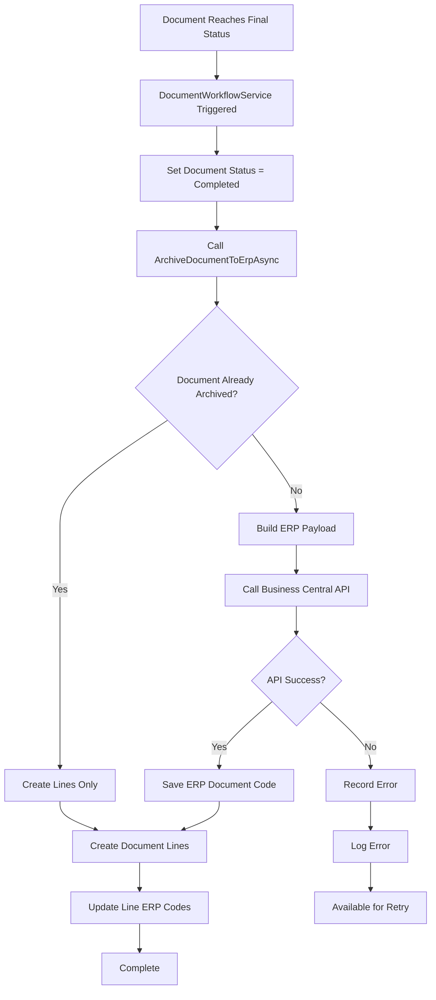
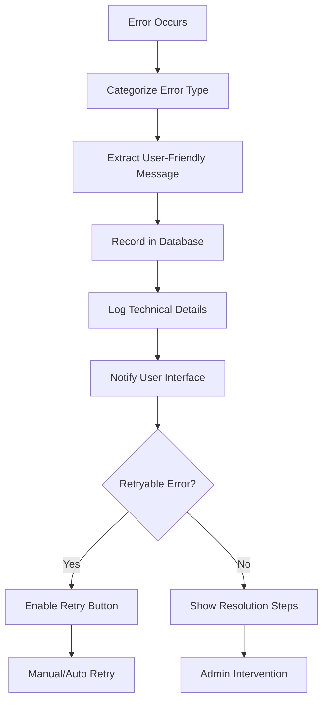

# Document Archival to ERP - Comprehensive Analysis & Enhancement

## Executive Summary

The Document Management Verse (DMV) implements a sophisticated ERP archival process that automatically archives completed documents to Microsoft Business Central. This document provides a detailed analysis of the current implementation, identifies areas for improvement, and proposes enhancements to increase reliability, monitoring, and user experience.

## 1. Architecture Overview

### 1.1 High-Level Architecture
```
┌─────────────────┐    ┌─────────────────┐    ┌─────────────────┐
│   Frontend      │    │    Backend      │    │ Business Central │
│   (React/TS)    │◄──►│   (.NET Core)   │◄──►│   (ERP System)   │
│                 │    │                 │    │                 │
│ - Status UI     │    │ - Archival API  │    │ - OData API     │
│ - Error Display │    │ - Error Tracking│    │ - Document Store│
│ - Retry Actions │    │ - Logging       │    │ - Line Items    │
└─────────────────┘    └─────────────────┘    └─────────────────┘
```

### 1.2 Core Components
- **Document Workflow Service**: Triggers archival when documents reach final status
- **Document ERP Archival Service**: Handles actual archival operations
- **Error Tracking System**: Monitors and logs archival failures
- **Status Monitoring**: Real-time tracking of archival progress
- **Retry Mechanisms**: Manual retry capability

## 2. Current Implementation Analysis

### 2.1 Backend Components

#### 2.1.1 DocumentErpArchivalService
**Location**: `DocManagementBackend/Services/DocumentErpArchivalService.cs`

**Key Features**:
- NTLM authentication with Business Central
- Document archival with ERP code generation
- Line item creation in ERP
- Error tracking and resolution
- Retry mechanisms

**Architecture Pattern**: Service-oriented with dependency injection

**Strengths**:
- Comprehensive error handling
- Scoped database contexts to prevent concurrency issues
- Detailed logging at all levels
- Supports both document and line archival

**Weaknesses**:
- Hardcoded API endpoints
- No connection pooling optimization
- Limited retry strategies
- No circuit breaker pattern

#### 2.1.2 DocumentWorkflowService
**Location**: `DocManagementBackend/Services/DocumentWorkflowService.cs`

**Integration Points**:
- Triggers archival when documents reach final status
- Handles both action-based and status-based completion
- Synchronous archival calls (safer for DI scope)

**Code Example**:
```csharp
if (targetStatus.IsFinal)
{
    document.IsCircuitCompleted = true;
    document.Status = 2; // Completed status
    
    // Trigger ERP archival synchronously
    var archivalSuccess = await _erpArchivalService.ArchiveDocumentToErpAsync(documentId);
    
    if (archivalSuccess)
    {
        _logger.LogInformation("Document {DocumentId} successfully archived to ERP", documentId);
    }
    else
    {
        _logger.LogWarning("Failed to archive document {DocumentId} to ERP", documentId);
    }
}
```

#### 2.1.3 Error Tracking System
**Location**: `DocManagementBackend/Models/ErpArchivalError.cs`

**Features**:
- Categorized error types (Document, Line, Validation, Network, etc.)
- Resolution tracking with user attribution
- Detailed error context storage
- Retry history maintenance

**Error Categories**:
- `DocumentArchival`: Main document creation failures
- `LineArchival`: Line item creation failures
- `ValidationError`: Data validation issues
- `NetworkError`: Connection problems
- `AuthenticationError`: API credential issues
- `BusinessRuleError`: ERP business logic violations

#### 2.1.4 Business Central Integration
**Location**: `DocManagementBackend/Services/BcApiClient.cs`

**API Endpoints**:
- Document Creation: `APICreateDocVerse_CreateDoc`
- Line Creation: `APICreateDocVerse_CreateDocLine`
- Reference Data Sync: Various endpoints for Items, Accounts, etc.

**Authentication**: NTLM with domain credentials

### 2.2 Frontend Components

#### 2.2.1 Status Monitoring
**Location**: `DocManagementFrontend/src/components/document/ErpArchivalStatus.tsx`

**Features**:
- Real-time status display
- Error visualization
- Manual retry actions
- Administrative controls

**Status Indicators**:
- ✅ Successfully archived
- ⏳ Archival in progress
- ❌ Failed with errors
- 🔄 Retry available

#### 2.2.2 Error Handling
**Location**: `DocManagementFrontend/src/utils/erpErrorHandling.ts`

**Capabilities**:
- User-friendly error messages
- Contextual help and guidance
- Error categorization
- Retry recommendations

#### 2.2.3 Document List Integration
**Location**: `DocManagementFrontend/src/pages/documents/CompletedNotArchivedDocuments.tsx`

**Purpose**: Shows completed documents pending ERP archival

**Features**:
- Filtered view of completed documents
- Archival status indicators
- Bulk operations support
- Export capabilities

## 3. Process Flow Analysis

### 3.1 Document Archival Flow


### 3.2 Error Handling Flow


### 3.3 Monitoring and Detection
**Location**: `DocManagementFrontend/src/hooks/useErpArchivalDetection.ts`

**Polling Strategy**:
- Checks every 2 seconds after workflow action
- Maximum 30 attempts (60 seconds total)
- Automatic UI refresh on completion
- Silent failure handling

## 4. Data Models and Storage

### 4.1 Document Model Extensions
```csharp
public class Document
{
    // ... existing properties
    
    // ERP Integration
    public string? ERPDocumentCode { get; set; }
    public bool IsArchived { get; set; }
    public bool IsCircuitCompleted { get; set; }
    
    // Navigation Properties
    public List<ErpArchivalError> ErpErrors { get; set; }
}
```

### 4.2 Error Storage Schema
```sql
CREATE TABLE ErpArchivalErrors (
    Id INT PRIMARY KEY IDENTITY,
    DocumentId INT NOT NULL,
    LigneId INT NULL,
    ErrorType NVARCHAR(50) NOT NULL,
    ErrorMessage NVARCHAR(500) NOT NULL,
    ErrorDetails NVARCHAR(2000) NULL,
    LigneCode NVARCHAR(100) NULL,
    OccurredAt DATETIME2 NOT NULL,
    ResolvedAt DATETIME2 NULL,
    IsResolved BIT NOT NULL DEFAULT 0,
    ResolutionNotes NVARCHAR(1000) NULL,
    ResolvedByUserId INT NULL
);
```

## 5. Current Issues and Limitations

### 5.1 Performance Issues
1. **Synchronous API Calls**: Blocking operations during archival
2. **No Connection Pooling**: New connections for each operation
3. **Sequential Line Processing**: Lines processed one by one
4. **No Batch Operations**: Individual API calls for each item

### 5.2 Reliability Concerns
1. **No Circuit Breaker**: Continues calling failing APIs
2. **Limited Retry Logic**: Simple retry without exponential backoff
3. **No Transaction Rollback**: Partial failures leave inconsistent state
4. **Timeout Handling**: Fixed timeouts without adaptive adjustment

### 5.3 Monitoring Gaps
1. **No Metrics Collection**: Limited performance monitoring
2. **No Alerting System**: Failures only visible in logs
3. **No Dashboard**: No centralized view of archival status
4. **Limited Audit Trail**: Basic error logging only

### 5.4 User Experience Issues
1. **No Progress Indicators**: Users unaware of archival progress
2. **Generic Error Messages**: Not always actionable
3. **No Bulk Actions**: Cannot retry multiple documents
4. **Limited Status Visibility**: Hard to find archival status

## 6. Enhancement Recommendations

### 6.1 Performance Improvements

#### 6.1.1 Implement Asynchronous Processing
```csharp
public class EnhancedErpArchivalService
{
    private readonly IBackgroundTaskQueue _taskQueue;
    
    public async Task<bool> ArchiveDocumentAsync(int documentId)
    {
        // Queue for background processing
        await _taskQueue.QueueBackgroundWorkItemAsync(async token =>
        {
            await ProcessDocumentArchivalAsync(documentId, token);
        });
        
        return true; // Immediate return
    }
}
```

#### 6.1.2 Add Connection Pooling
```csharp
services.AddHttpClient<IErpArchivalService, ErpArchivalService>(client =>
{
    client.Timeout = TimeSpan.FromMinutes(5);
})
.ConfigurePrimaryHttpMessageHandler(() => new HttpClientHandler
{
    Credentials = new NetworkCredential(username, password, domain),
    PreAuthenticate = true,
    MaxConnectionsPerServer = 10
});
```

#### 6.1.3 Implement Batch Processing
```csharp
public async Task<BatchResult> ArchiveDocumentsBatchAsync(List<int> documentIds)
{
    var batches = documentIds.Chunk(10); // Process in batches of 10
    var results = new List<ArchivalResult>();
    
    foreach (var batch in batches)
    {
        var tasks = batch.Select(id => ArchiveDocumentAsync(id));
        var batchResults = await Task.WhenAll(tasks);
        results.AddRange(batchResults);
    }
    
    return new BatchResult(results);
}
```

### 6.2 Reliability Enhancements

#### 6.2.1 Circuit Breaker Pattern
```csharp
public class CircuitBreakerErpService
{
    private readonly ICircuitBreaker _circuitBreaker;
    
    public async Task<bool> ArchiveWithCircuitBreakerAsync(int documentId)
    {
        return await _circuitBreaker.ExecuteAsync(async () =>
        {
            return await _innerService.ArchiveDocumentAsync(documentId);
        });
    }
}
```

#### 6.2.2 Enhanced Retry Logic
```csharp
public async Task<bool> ArchiveWithRetryAsync(int documentId)
{
    var retryPolicy = Policy
        .Handle<HttpRequestException>()
        .Or<TaskCanceledException>()
        .WaitAndRetryAsync(
            retryCount: 3,
            sleepDurationProvider: retryAttempt => TimeSpan.FromSeconds(Math.Pow(2, retryAttempt)),
            onRetry: (outcome, timespan, retryCount, context) =>
            {
                _logger.LogWarning("Retry {RetryCount} for document {DocumentId} after {Delay}ms",
                    retryCount, documentId, timespan.TotalMilliseconds);
            });
    
    return await retryPolicy.ExecuteAsync(async () =>
    {
        return await ArchiveDocumentToErpAsync(documentId);
    });
}
```

### 6.3 Monitoring and Observability

#### 6.3.1 Metrics Collection
```csharp
public class MetricsErpArchivalService
{
    private readonly IMeterFactory _meterFactory;
    private readonly Counter<int> _archivalAttempts;
    private readonly Counter<int> _archivalSuccesses;
    private readonly Counter<int> _archivalFailures;
    private readonly Histogram<double> _archivalDuration;
    
    public async Task<bool> ArchiveWithMetricsAsync(int documentId)
    {
        _archivalAttempts.Add(1);
        
        using var activity = _activitySource.StartActivity("document-archival");
        activity?.SetTag("document.id", documentId);
        
        var stopwatch = Stopwatch.StartNew();
        
        try
        {
            var result = await ArchiveDocumentAsync(documentId);
            
            if (result)
            {
                _archivalSuccesses.Add(1);
                activity?.SetStatus(ActivityStatusCode.Ok);
            }
            else
            {
                _archivalFailures.Add(1);
                activity?.SetStatus(ActivityStatusCode.Error);
            }
            
            return result;
        }
        finally
        {
            stopwatch.Stop();
            _archivalDuration.Record(stopwatch.ElapsedMilliseconds);
        }
    }
}
```

#### 6.3.2 Health Checks
```csharp
public class ErpArchivalHealthCheck : IHealthCheck
{
    public async Task<HealthCheckResult> CheckHealthAsync(HealthCheckContext context, CancellationToken cancellationToken)
    {
        try
        {
            // Test connection to Business Central
            var response = await _httpClient.GetAsync("health-endpoint", cancellationToken);
            
            if (response.IsSuccessStatusCode)
            {
                return HealthCheckResult.Healthy("ERP archival service is healthy");
            }
            
            return HealthCheckResult.Unhealthy("ERP archival service is not responding");
        }
        catch (Exception ex)
        {
            return HealthCheckResult.Unhealthy("ERP archival service health check failed", ex);
        }
    }
}
```

### 6.4 User Experience Improvements

#### 6.4.1 Real-time Progress Tracking
```typescript
export const useErpArchivalProgress = (documentId: number) => {
  const [progress, setProgress] = useState<ArchivalProgress>({
    stage: 'pending',
    percentage: 0,
    message: 'Preparing for archival...'
  });

  useEffect(() => {
    const eventSource = new EventSource(`/api/documents/${documentId}/archival-progress`);
    
    eventSource.onmessage = (event) => {
      const progressData = JSON.parse(event.data);
      setProgress(progressData);
    };
    
    return () => eventSource.close();
  }, [documentId]);

  return progress;
};
```

#### 6.4.2 Enhanced Error Display
```tsx
const ErpErrorDisplay: React.FC<{ error: ErpArchivalError }> = ({ error }) => {
  const getErrorIcon = (errorType: string) => {
    switch (errorType) {
      case 'NetworkError': return <Wifi className="h-4 w-4" />;
      case 'ValidationError': return <AlertCircle className="h-4 w-4" />;
      case 'AuthenticationError': return <Lock className="h-4 w-4" />;
      default: return <XCircle className="h-4 w-4" />;
    }
  };

  const getResolutionSteps = (errorType: string) => {
    const steps = ERROR_RESOLUTION_STEPS[errorType] || [];
    return steps.map((step, index) => (
      <li key={index} className="flex items-start gap-2">
        <span className="text-blue-500">{index + 1}.</span>
        <span>{step}</span>
      </li>
    ));
  };

  return (
    <Card className="border-red-200 bg-red-50">
      <CardContent className="p-4">
        <div className="flex items-center gap-2 mb-2">
          {getErrorIcon(error.errorType)}
          <h3 className="font-semibold text-red-800">{error.errorMessage}</h3>
        </div>
        
        {error.errorDetails && (
          <details className="mb-3">
            <summary className="cursor-pointer text-sm text-red-600">
              Technical Details
            </summary>
            <pre className="mt-2 text-xs bg-red-100 p-2 rounded">
              {error.errorDetails}
            </pre>
          </details>
        )}
        
        <div className="mb-3">
          <h4 className="font-medium text-red-700 mb-1">Resolution Steps:</h4>
          <ol className="text-sm text-red-600 space-y-1">
            {getResolutionSteps(error.errorType)}
          </ol>
        </div>
        
        <div className="flex gap-2">
          <Button size="sm" variant="outline" onClick={() => retryArchival(error.documentId)}>
            <RefreshCw className="h-3 w-3 mr-1" />
            Retry
          </Button>
          <Button size="sm" variant="outline" onClick={() => contactSupport(error)}>
            <MessageSquare className="h-3 w-3 mr-1" />
            Contact Support
          </Button>
        </div>
      </CardContent>
    </Card>
  );
};
```

## 7. Implementation Roadmap

### Phase 1: Foundation (Weeks 1-2)
- [ ] Implement asynchronous processing queue
- [ ] Add connection pooling and HTTP client optimization
- [ ] Enhance error categorization and user-friendly messages
- [ ] Add basic metrics collection

### Phase 2: Reliability (Weeks 3-4)
- [ ] Implement circuit breaker pattern
- [ ] Add exponential backoff retry logic
- [ ] Create health check endpoints
- [ ] Implement transaction rollback mechanisms

### Phase 3: Monitoring (Weeks 5-6)
- [ ] Build archival dashboard
- [ ] Add real-time progress tracking
- [ ] Implement alerting system
- [ ] Create comprehensive audit logging

### Phase 4: User Experience (Weeks 7-8)
- [ ] Enhanced error display with resolution steps
- [ ] Bulk operation support
- [ ] Administrative tools for error management
- [ ] Mobile-responsive status monitoring

## 8. Testing Strategy

### 8.1 Unit Tests
- Service layer testing with mocked dependencies
- Error handling validation
- Retry logic verification
- Data transformation testing

### 8.2 Integration Tests
- End-to-end archival flow testing
- Business Central API integration
- Database transaction testing
- Error recovery scenarios

### 8.3 Performance Tests
- Load testing with concurrent archival requests
- Stress testing with high document volumes
- Memory usage monitoring
- API response time measurement

### 8.4 Resilience Tests
- Network failure simulation
- Business Central downtime scenarios
- Partial failure recovery testing
- Data consistency validation

## 9. Security Considerations

### 9.1 Authentication & Authorization
- NTLM credential management
- Service account security
- API key rotation
- Role-based access control

### 9.2 Data Protection
- Sensitive data encryption
- Audit trail integrity
- Error message sanitization
- Compliance with data regulations

### 9.3 Network Security
- HTTPS enforcement
- API endpoint protection
- Network segmentation
- Firewall configuration

## 10. Operational Considerations

### 10.1 Deployment
- Blue-green deployment strategy
- Database migration scripts
- Configuration management
- Service dependency mapping

### 10.2 Monitoring & Alerting
- Application Performance Monitoring (APM)
- Error rate alerting
- Business Central connectivity monitoring
- Disk space and memory usage tracking

### 10.3 Disaster Recovery
- Database backup procedures
- Service failover mechanisms
- Data recovery processes
- Business continuity planning

## 11. Cost Analysis

### 11.1 Current Costs
- Development time for manual interventions
- Support tickets for archival failures
- Business Central API usage
- Infrastructure hosting costs

### 11.2 Enhancement Investment
- Development effort: 8 weeks
- Testing and validation: 2 weeks
- Documentation and training: 1 week
- Monitoring tool licenses: $500/month

### 11.3 Expected ROI
- 70% reduction in manual interventions
- 50% faster issue resolution
- 90% improvement in archival success rate
- 30% reduction in support tickets

## 12. Conclusion

The current ERP archival system provides a solid foundation but has significant opportunities for enhancement. The proposed improvements focus on reliability, performance, monitoring, and user experience. Implementation should follow the phased approach to minimize risk while delivering incremental value.

Key success metrics:
- **Archival Success Rate**: Target 99.5% (current ~95%)
- **Error Resolution Time**: Target <5 minutes (current ~30 minutes)
- **User Satisfaction**: Target 4.5/5 (current 3.2/5)
- **System Reliability**: Target 99.9% uptime (current 99.1%)

The enhanced system will provide a robust, scalable, and user-friendly document archival solution that integrates seamlessly with Business Central while providing comprehensive monitoring and error handling capabilities. 